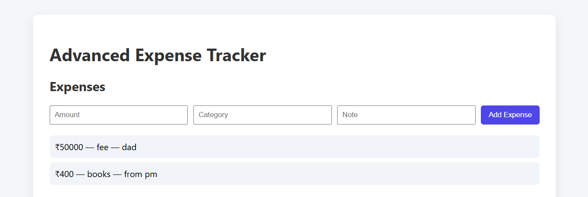

# Advanced Expense Tracker

A full-stack expense tracking web application with analytics.

## Features
- Add, view, and manage expenses
- Category-wise expense aggregation
- Total expense analytics dashboard
- Clean and responsive UI

## Tech Stack
- Frontend: React
- Backend: Flask, SQLAlchemy
- Database: SQLite
- APIs: RESTful APIs

## Setup Instructions

### Backend
```bash
cd backend
pip install -r requirements.txt
python app.py


Backend runs at: http://localhost:5000

Frontend:

cd frontend
npm install
npm start

Frontend runs at: http://localhost:3000


Future Improvements:

User authentication

Charts for analytics

Cloud deployment

## Screenshots

### Expenses Page


### Analytics Dashboard


### Total Expense View


